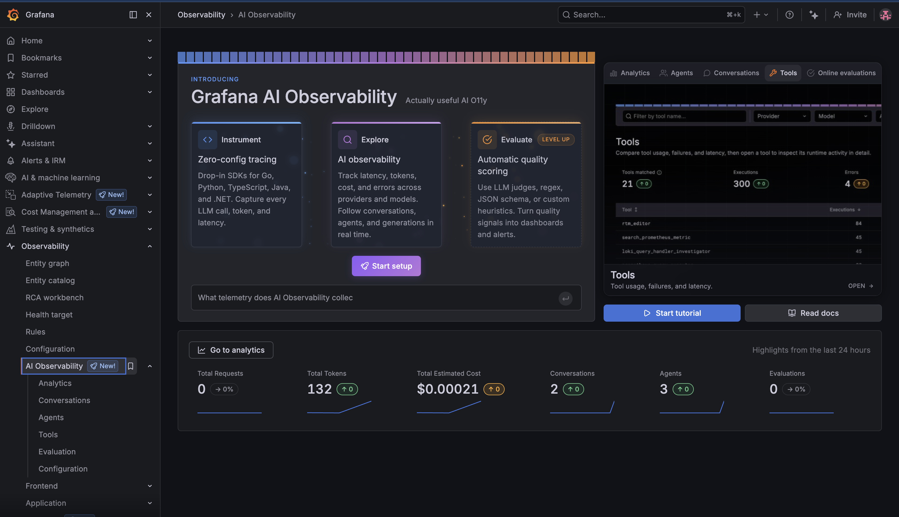
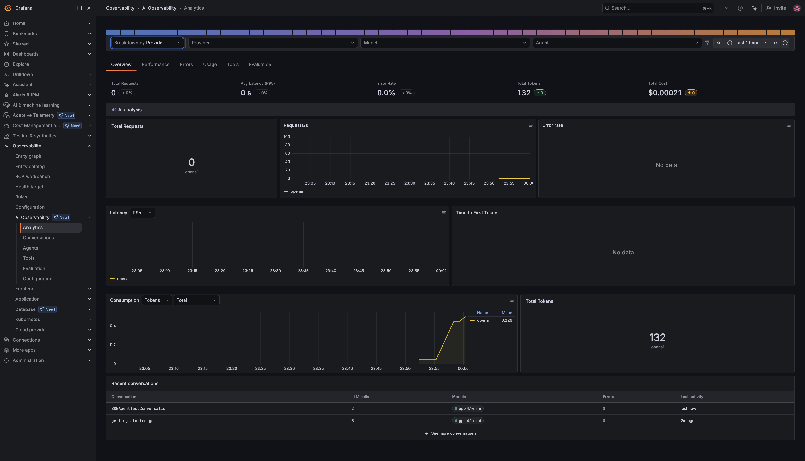
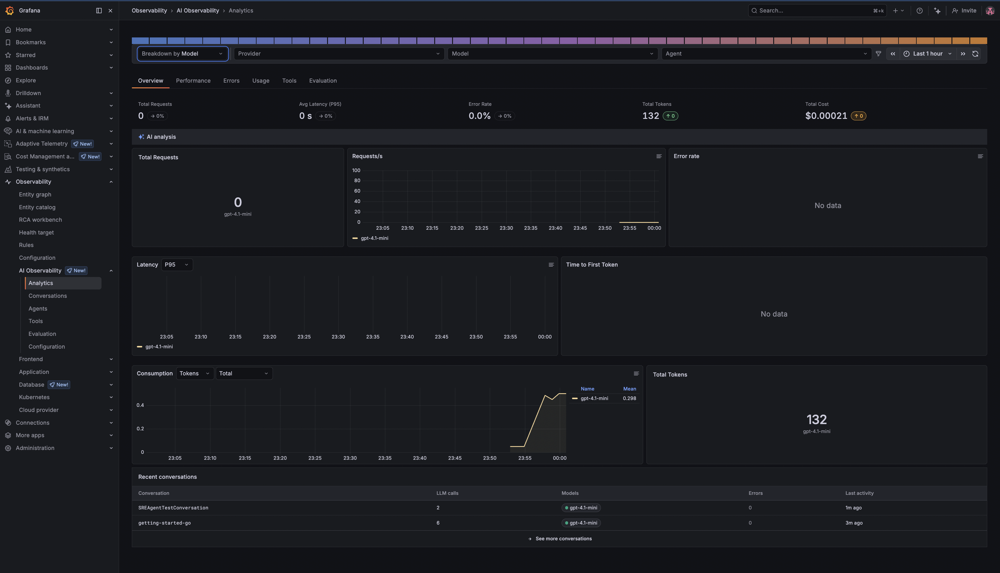
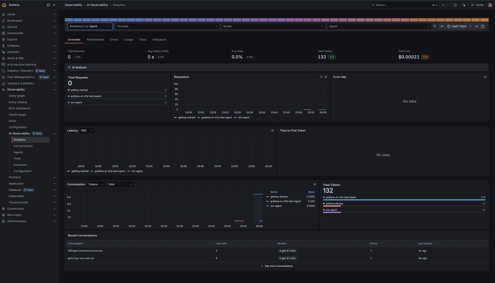
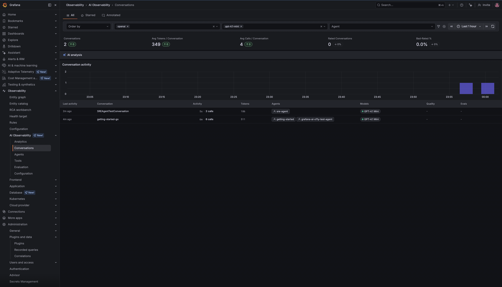
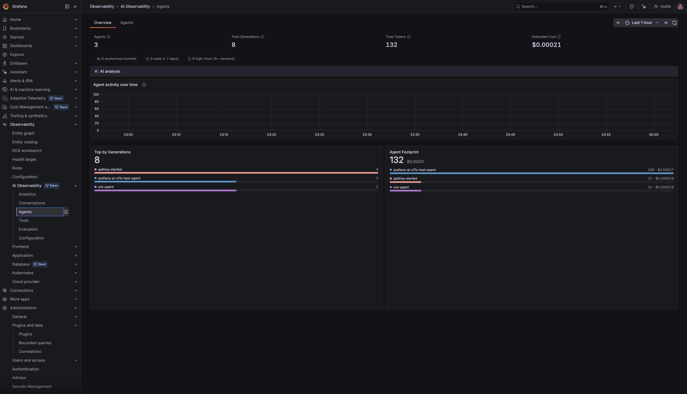
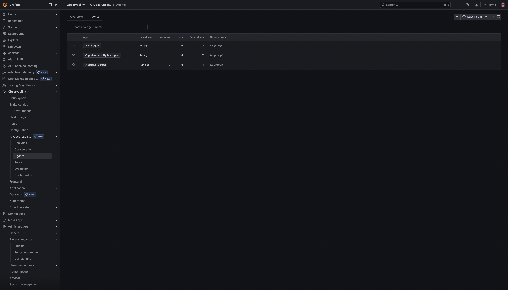
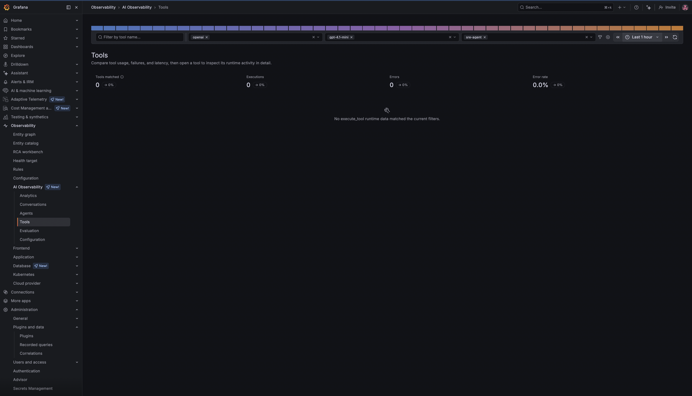
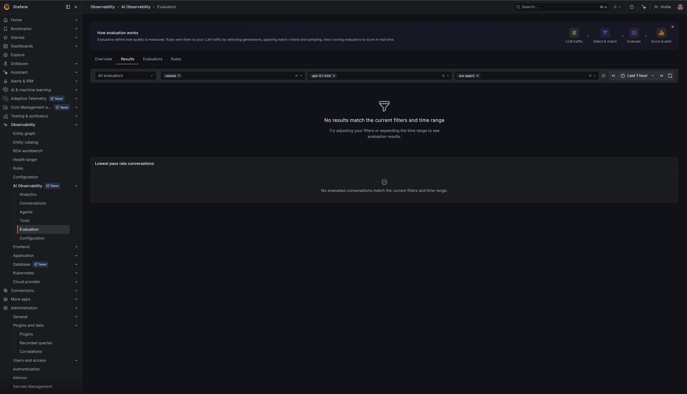

# Getting Started — Go

Makes an OpenAI chat completion and records the generation to Grafana Cloud AI Observability.

## Setup

```bash
cd examples/getting-started/go
cp .env.example .env
# Fill in your credentials in .env — see the SDK README for where to find each value.
go mod tidy
```

## Run

```bash
go run .
```

## Grafana AI Observability Dashboards Sample


















